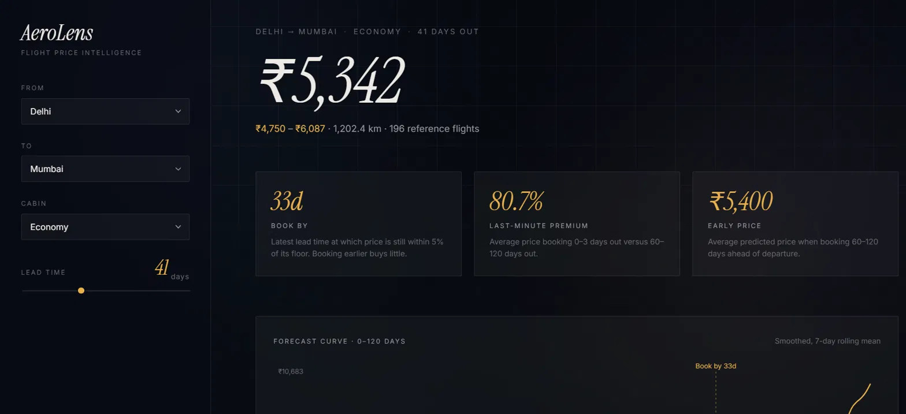
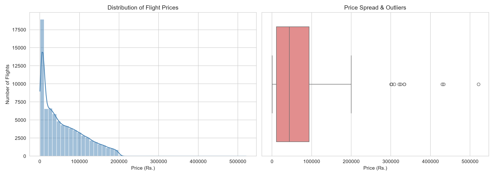
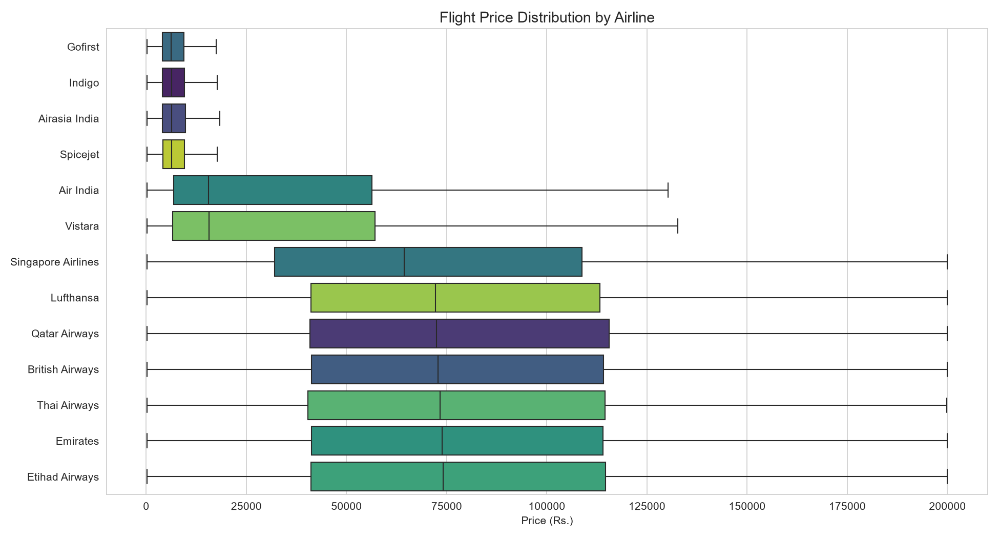
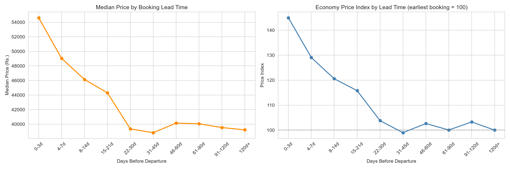
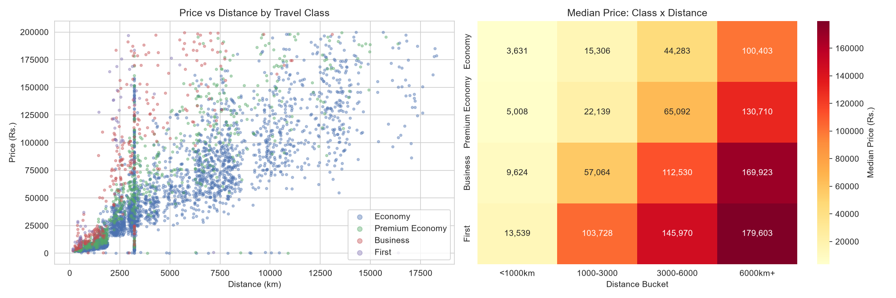
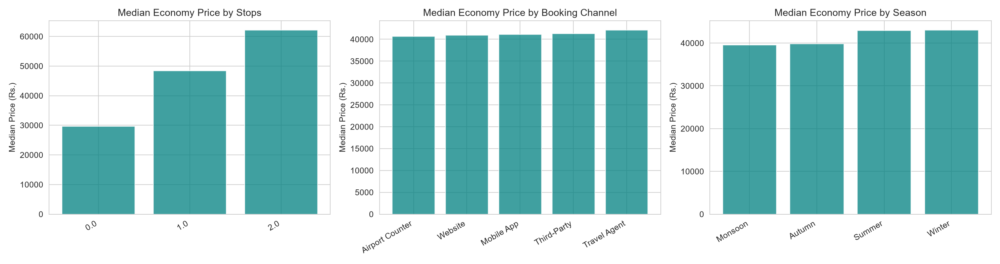
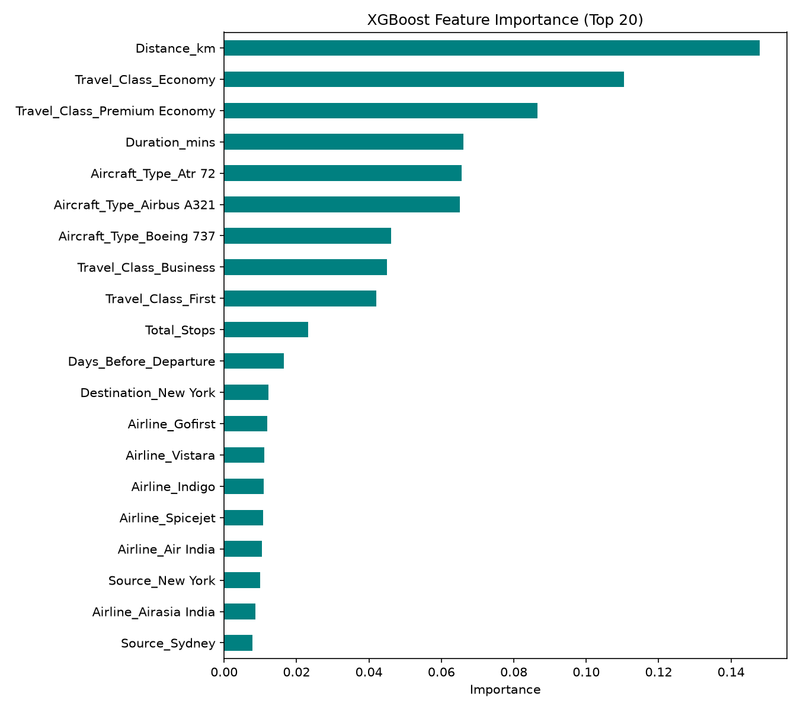
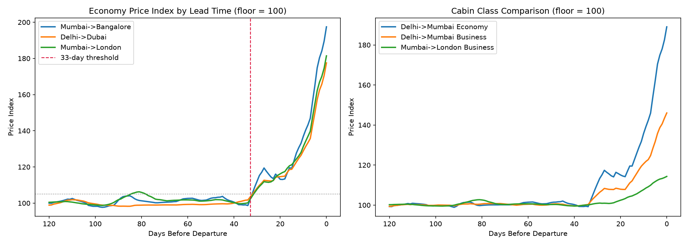
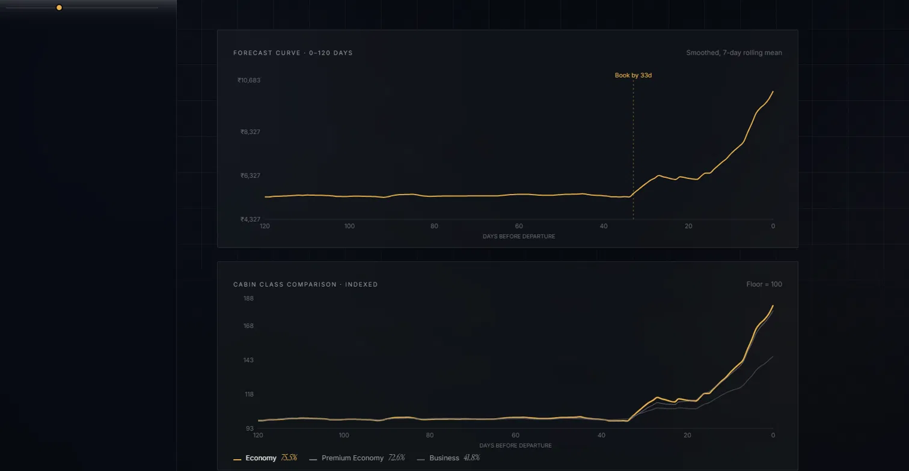

# AeroLens

**Flight fare analysis and booking-time forecasting on 100,000 flight records.**

An end-to-end data science pipeline that cleans a deliberately corrupted dataset,
identifies what actually drives airfare, predicts prices to within ~15%, and
forecasts the optimal booking window — surfaced through a live dashboard.

---

## Project Overview

AeroLens answers three questions about flight pricing:

1. **What does a flight cost?** An XGBoost regression model predicts fares from
   route, cabin class, distance, and booking lead time (R² = 0.897, MAE ₹9,675).
2. **What drives the price?** Feature analysis using two complementary methods
   separates genuine price drivers from proxy variables.
3. **When should you book?** Counterfactual forecasting identifies a stable
   ~33-day booking threshold for Economy fares, beyond which booking earlier
   yields under 5% additional saving.

The headline finding: **book Economy at least 30 days ahead.** Prices are flat
from 120+ days down to roughly 33 days, then climb 70–86% in the final days
before departure. Booking earlier than that buys almost nothing.

---

## Problem Statement

Airline pricing is opaque to travellers. Fares for the same route vary by an
order of magnitude depending on factors that aren't visible at booking time,
and conventional wisdom ("book early", "fly midweek", "use incognito mode")
is largely untested.

This project uses a 100,000-record flight dataset to establish empirically
which factors move price, by how much, and what a traveller can actually
control. The dataset was supplied with deliberate data-quality defects, so a
substantial part of the work is detecting and handling contamination without
destroying legitimate signal.

---

## Dataset Used

**Source:** Supplied dataset — 100,000 rows × 18 columns
**Domain:** Flight bookings across 18 cities (domestic Indian and
international), 13 airlines, 4 cabin classes, departure dates spanning
2025-01-01 to 2026-12-31.

**Columns:** `Flight_ID, Airline, Source, Destination, Departure_Date,
Departure_Time, Arrival_Time, Duration, Total_Stops, Distance_km, Travel_Class,
Days_Before_Departure, Season, Weekday, Aircraft_Type, Booking_Channel,
Passenger_Count, Price`

**Data quality defects present in the raw file:**

| Issue | Detail |
|---|---|
| All columns typed as text | Including `Price`, `Distance_km`, `Duration` |
| Mixed currency formats | `"Rs. 200,000.00"` alongside `"5181.56"` |
| Three duration encodings | `"3h 11m"`, `"1.67"` (decimal hours), `"177 min"` |
| Text/numeric collisions | `"non-stop"` and `"0"`; `"two"` and `"2"` |
| City name variants | 54 forms for 18 cities — `Hyderabad`, `Hyderabad Airport`, `Hyd` |
| Missing values | ~5% per column, near-uniform |
| Duplicate rows | 1,961 exact duplicates |
| Placeholder prices | `200000` appearing 9,112 times; also `2000`, `15000`, `25000` |
| Injected extreme prices | e.g. Economy short-haul fares above ₹300,000 |

---

## Methodology

### Part 1 — Cleaning and exploratory analysis

**Format normalisation.** Currency symbols stripped, three duration formats
unified to minutes, stop and passenger text mapped to integers, 54 city-name
variants collapsed to 18 canonical names, dates parsed, 1,961 duplicates removed.

**Missing values.** Numeric features imputed with median (robust to outliers),
categoricals with mode. Rows missing `Price` were **dropped, not imputed** —
fabricating the target variable would mean training on invented answers.

**Contamination handling — flag, never delete.** Two independent patterns were
found. Rather than removing rows, both are marked with boolean columns
(`Price_Flagged`, `Price_Outlier`), leaving all 93,083 records intact and every
exclusion auditable.

**Contextual outlier detection.** A fixed price threshold cannot work when
₹150,000 is a normal long-haul First fare and an impossible short-haul Economy
one. Outliers are therefore detected **within `Travel_Class` × distance-bucket
peer groups**, using **3×IQR** rather than the conventional 1.5× to preserve the
fat tail that airfare genuinely has.

**Result:** 778 rows (0.98%) excluded. Skewness fell from **4.827 to 0.836**
while the median moved only ₹44,556 → ₹43,981. Removing 1% of rows cannot
flatten a genuine fat tail — this is the evidence that the values were injected
rather than real.

### Part 2 — Modelling

Three models were trained on 13 features (8 categorical one-hot encoded to 82
columns), with an 80/20 train-test split held out before any fitting.

| Model | MAE | RMSE | R² |
|---|---|---|---|
| Linear Regression | ₹17,174 | ₹24,040 | 0.784 |
| Random Forest | ₹10,087 | ₹17,097 | 0.891 |
| **XGBoost** | **₹9,675** | **₹16,590** | **0.897** |

Linear regression was included as a documented baseline and expected to
underfit: EDA showed price scales *sub-linearly* with distance (flattening past
~2,500 km) and that the cabin-class premium *multiplies* with distance rather
than adding to it. Its error profile — RMSE exceeding MAE by 40% — confirms
systematic misfit at the distribution extremes.

**Feature importance was measured two ways, and they disagree instructively:**

| Feature | Gain importance | Permutation importance |
|---|---|---|
| Distance_km | 0.148 (3rd) | **1.007 (1st)** |
| Travel_Class | 0.284 (1st) | 0.312 (2nd) |
| Duration_mins | 0.066 (6th) | 0.228 (3rd) |
| Days_Before_Departure | 0.017 (11th) | **0.129 (4th)** |
| Aircraft_Type | **0.190 (2nd)** | **0.004 (11th)** |

Gain counts how often trees split on a feature; permutation measures actual
accuracy lost when the feature is shuffled. Aircraft type's collapse from 2nd to
11th shows it is **redundant with distance and duration** rather than
independently informative — empirically confirming the EDA hypothesis that
aircraft type proxies haul length. Permutation importance is reported as the
primary measure.

### Part 3 — Forecasting

The trained model generates **counterfactual price curves**. For a given route
and cabin, up to 200 real flights are sampled, each cloned 121 times with every
feature held fixed except `Days_Before_Departure`, then predicted and averaged
column-wise.

Averaging is necessary because XGBoost's base learners are piecewise-constant —
a single flight's curve is a step function. Averaging over flights whose split
boundaries differ recovers a smooth response; a centred 7-day rolling mean
removes residual jitter.

| Route | Class | 60–120d | 0–3d | Premium | Book by |
|---|---|---|---|---|---|
| Delhi → Mumbai | Economy | ₹5,400 | ₹9,756 | 80.7% | 33 days |
| Mumbai → Bangalore | Economy | ₹3,524 | ₹6,569 | 86.4% | 33 days |
| Delhi → Dubai | Economy | ₹23,352 | ₹39,712 | 70.1% | 33 days |
| Mumbai → London | Economy | ₹70,997 | ₹121,156 | 70.6% | 32 days |
| Delhi → Mumbai | Business | ₹15,008 | ₹21,285 | 41.8% | 31 days |
| Mumbai → London | Business | ₹161,993 | ₹182,939 | 12.9% | 15 days |

---

## Results

### Major factors affecting price

| Factor | Effect | Interpretation |
|---|---|---|
| Distance × Class | **49× range** | ₹3,631 → ₹179,603; sub-linear past ~2,500 km |
| Aircraft type | 1060% spread | Proxy for haul length, not a cause |
| Stops | 110% spread | Largely distance in disguise |
| **Booking timing** | **45–86%** | **The only substantial traveller-controlled lever** |
| Season | 8.8% | Marginal |
| Weekday | 8.2% | Marginal |
| Booking channel | 3.6% | No meaningful effect |

Price per kilometre by cabin: Economy ₹12.78, Premium Economy ₹16.16,
Business ₹27.50, First ₹39.63.

### Recommendations for travellers

1. **Book Economy at least 30 days ahead.** Fares are flat from 120+ days down
   to ~33 days, then rise 70–86%. Booking earlier than 33 days saves under 5%.
2. **Don't channel-shop.** Airport counter, website, app, third-party and travel
   agent differ by 3.6% — within noise.
3. **Season and weekday aren't worth planning around** (<9% each).
4. **Cabin class is the largest controllable cost** — Economy costs roughly a
   third of First per kilometre.
5. **Premium long-haul is the exception.** Mumbai→London Business moves only
   12.9%, so booking early offers little benefit there.

### Convergent validation

The 30-day threshold was reached three independent ways:

| Method | Threshold | Premium |
|---|---|---|
| Observed medians, all Economy (no model) | ~30 days | 45% |
| Segment table, class + distance held fixed | ~30 days | 60% |
| Model counterfactual, four Economy routes | 32–33 days | 70–86% |

Premium estimates rise with tightness of control — pooling all Economy routes
dilutes the effect, since long-haul fares move proportionally less. The first
method involves no model at all, so agreement constitutes independent
confirmation rather than circular reasoning.

---

## Technologies Used

| Layer | Stack |
|---|---|
| Analysis | Python 3.11, pandas, NumPy |
| Modelling | scikit-learn, XGBoost, joblib |
| Visualisation | matplotlib, seaborn |
| Backend | FastAPI, Uvicorn, Pydantic |
| Frontend | React 19, Vite, Recharts |
| Storage | Supabase (PostgreSQL) |
| Version control | Git, GitHub |

**Architecture:** the analysis pipeline writes a serialised model to `models/`;
a FastAPI service loads it and exposes prediction and forecasting endpoints over
HTTP; a React SPA consumes those endpoints. Analysis logic lives entirely in the
backend — the frontend is a rendering layer, so the API returns pre-computed
figures like the booking threshold rather than having the client reimplement them.

---

## Installation Instructions

**Prerequisites:** Python 3.11+, Node.js 18+

```bash
git clone https://github.com/SunKun001/AeroLens.git
cd AeroLens
```

**Backend:**

```bash
python -m venv .venv
# Windows
.venv\Scripts\activate
# macOS/Linux
source .venv/bin/activate

pip install -r requirements.txt
uvicorn api.main:app --reload
```

API runs at `http://127.0.0.1:8000`. Interactive docs at `/docs`.

**Frontend** (in a second terminal):

```bash
cd frontend
npm install
npm run dev
```

Dashboard runs at `http://localhost:5173`. Both servers must be running.

**Reproducing the analysis** (optional — outputs are committed):

```bash
python scripts/exploration.py      # cleaning
python scripts/visualization.py    # charts 1-5
python scripts/modeling.py         # trains and saves the model
python scripts/forecasting.py      # forecast curves, charts 6-7
```

**Note on hosting:** the application is not deployed publicly. The Python
dependency bundle (xgboost, scipy, pandas, scikit-learn) totals ~948MB, which
exceeds the limits of the serverless platforms evaluated. See the demo video, or
run locally per the instructions above.

---

## Challenges Faced

Six approaches were tried and rejected on evidence. Full detail in
[`methodology_notes.md`](methodology_notes.md).

**1. Deleting suspicious prices.** The initial approach nulled out placeholder
values, silently destroying ~15% of rows on a judgement call with no audit
trail. Replaced with boolean flagging — all data retained, filtering happens
downstream, every exclusion inspectable.

**2. A fixed outlier threshold.** Any global price cutoff misclassifies, because
plausibility is contextual. Resolved with peer-group IQR fences.

**3. Order dependency in the cleaning pipeline.** Fitting IQR fences on the full
dataset gave 2,213 flagged rows and a skew of only 0.853 — the 9,112 placeholder
rows at ₹200,000 sat *inside* their peer groups and corrupted the quartiles used
to detect them. Fitting on the placeholder-excluded population gave 778 rows and
skew 0.836. **Contamination must be removed before estimating the statistics
used to detect further contamination.**

**4. Small-sample noise in the timing chart.** Taking medians at each individual
lead-time value gave ~430 flights per point, mixing Economy short-hauls with
First long-hauls; output oscillated between ₹27k and ₹68k with no visible trend.
Fixed by binning lead time and restricting to a single cabin class.

**5. Log-transformed target.** Tested and rejected — R² fell 0.897 → 0.876.
Post-cleaning skewness was already 0.836, so the transform addressed a problem
that no longer existed.

**6. Single-flight forecast curves.** Produced a jagged, non-monotonic curve and
an implausible 198% "saving" by comparing the minimum and maximum predicted days
— both noise-influenced extrema. Resolved by averaging across 200 flights and
comparing *windows* rather than single days.

**7. Deployment.** Three platforms attempted. Render's site was unreachable;
Railway built a stale commit during a platform incident; Vercel's build failed at
948MB against a 500MB ceiling. The dependency footprint of an XGBoost inference
service exceeds free-tier serverless limits.

---

## Future Improvements

- **Temporal features.** `Departure_Date`, `Departure_Time`, and `Arrival_Time`
  are currently dropped. Extracting month, day-of-year, and hour-of-day would
  likely capture seasonal and time-of-day effects the model can't currently see.
- **Hyperparameter search.** XGBoost parameters were chosen by judgement, not
  cross-validated search. A tuned model would likely improve on R² = 0.897.
- **SHAP values** for per-prediction explanations, rather than global feature
  importance only.
- **Route-level models.** Booking dynamics differ substantially by segment
  (Economy 80% premium vs long-haul Business 13%), so per-segment models may
  outperform one global model.
- **Prediction intervals** rather than point estimates, given ~15% median error.
- **Containerised deployment** to a platform without serverless size limits.

---

## Limitations

- Model accuracy is **~15% median error** across all cabin classes. Predictions
  are directional, not fare quotes.
- The model learned a **statistical association** between lead time and price,
  not airlines' actual yield-management logic. A pricing policy change would
  render forecasts confidently wrong with no signal in the data.
- The 32–33 day threshold clusters more tightly across dissimilar routes than
  real-world pricing would produce, suggesting the dataset encodes a fixed timing
  rule that the model recovered. This is evidence the model works — not evidence
  about real airline pricing.
- Roughly 10% of price variance remains unexplained, reflecting factors absent
  from the data: seat inventory, demand signals, promotions, and fare classes
  within cabins.

---

## Screenshots

### Dashboard


### Price distribution


### Price by airline


### Booking lead time


### Distance × cabin class


### Secondary factors


### Feature importance


### Forecast curves



## Repository Structure

AeroLens/
├── api/ FastAPI backend
│ └── main.py Four endpoints: options, predict, forecast, compare
├── charts/ Generated visualisations (7 PNGs)
├── data/ Cleaned datasets
├── frontend/ React + Vite dashboard
│ └── src/App.jsx
├── models/ Serialised XGBoost pipeline
├── scripts/
│ ├── exploration.py Cleaning and preprocessing
│ ├── visualization.py EDA charts
│ ├── modeling.py Training, evaluation, feature importance
│ ├── forecasting.py Counterfactual forecast curves
│ └── upload_to_supa.py Supabase ingestion
├── insights.md Findings and recommendations
├── methodology_notes.md Rejected approaches, documented
├── requirements.txt
└── README.md

## Author

**Suneev Kundu**

Dataset provided as part of the AI Travel Analyst assignment.

## Screenshots

### Dashboard — live prediction


### Forecast curve and cabin comparison

